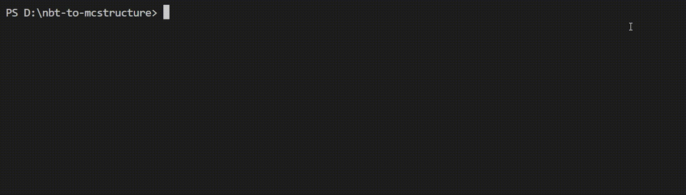

# nbt-to-mcstructure
 Converts Java .nbt files to Bedrock .mcstructure files



## Introduction

This program is a port of [Structure Editor](https://mcbe-essentials.github.io/structure-editor/) originally made by [MCBE Essentials](https://mcbe-essentials.github.io/) in Python 3.

The reason this program is built in Python is because:
- JavaScript has a limit on the size of what `Buffer` and array can allocate in the engine unlike Python.
- Structure templates generated in their [structure editor](https://mcbe-essentials.github.io/structure-editor/) does not work in Minecraft, because Minecraft requires the `"block_indices"` field's arrays need to both be the same size.

## Usage

1. Install required dependencies via:
    ```
    pip install -r requirements.txt
    ```

2. To convert `.nbt` files to `.mcstructure`, put your Java nbt files in the `structures` folder.

3. Run `__main__.py`, the program converts all java structures in the `structures` folder to the bedrock structure format, and they should be generated in `structures` folder.

⚠️**Make sure your computer has enough memory and spaces on disk to convert large NBT files!**

## Regolith Filter

This converter is available as a [Regolith](https://github.com/Bedrock-OSS/regolith) filter as well.
The filter allows you to place your `.nbt` structure files straight into the `packs/BP/structures` folder which will be compiled into the `.mcstructure` format. The original `.nbt` will be removed in the compiled version.

You can install this filter through CLI with:
```
regolith install github.com/JaylyDev/nbt-to-mcstructure/nbt-to-mcstructure==regolith-filter
```

Add this to your Regolith filter definitions to enable the filter.

```jsonc
"nbt_to_mcstructure": {"url": "github.com/JaylyDev/nbt-to-mcstructure", "version": "regolith-filter"}
```

When installed, it will generate a `settings.json` file in `data/nbt-to-mcstructure/` folder. This holds settings for block mapping using other vanilla overwrites or functionality for a custom namespace.
```jsonc
{
    "block_mapping": [
        {
            "structure_id": "add_your_structure_id_here", // This is the exact same name as your filename excluding the file suffix.
            "mapping": {
                "minecraft:dirt": "namespace:custom_dirt",
                "minecraft:stone": "namespace:custom_stone"
            }
        },
        {
            "structure_id": "add_another_structure_id_here",
            "mapping": {
                "minecraft:diamond_block": "namespace:custom_diamond_block",
                "minecraft:iron_ore": "namespace:custom_iron_ore"
            }
        }
    ]
}
```